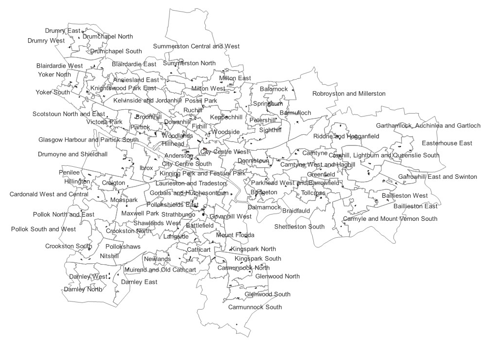

```{r setup, include=FALSE}
knitr::opts_chunk$set(echo = TRUE)
library(tidyverse)
library(sf)
library(plotly)
library(rstatix)
library(sfarrow)
options(scipen = 999)

```
# Geographic Boundary
## Description
* Scotland has its own names and theresholds for the Census boundaries.
* It is different from England and Wales.
* Output Areas (OAs) in Scotland are based on both population and household but Data Zone (DZ) and Intermediate Zone (IZ) are based on poulation only.
* In England, OAs, LSOAs, and MSOAs are all based on both population and household.
* For more information, please visit: https://scotborders.gov.uk/info/20015/your_council/65/research_and_data/5

## What does Glasgow look like?

```{r, echo=F}

```


* Output Areas: 5486 for Glasgow (11.8%); 46,351 for the whole of Scotland
* Data Zones: 746 for Glasgow (10.6%); 6976 covering the whole of Scotland
* Intermediate Zones: 136 for Glasgow (10.6%); 1,279 covering the whole of Scotland.

| Country  | Boundary Name            | Pop-Min | Pop-Max | Household-Min | Household-Max | Total No.Scot 11' | Total No. Glasgow 11' |
|----------|-------------------|---------|---------|-----------|------------|-------------------|--------------|
| Scotland | Output Area              | 50      | -      | 20            | -            |  46351                   | 5486         |
|          | Datazone                 | 500     | 1000    | -            | -            |  6976                    | 746          |
|          | Intermediate Zone        | 2500    | 6000    | -            | -            |  1279                    | 136          |
| England  | Output Area              | 100     | -      | 40            | -            |  181408                  | -           |
|          | Lower Super Output Area  | 1000    | 3000    | 400           | 1200        | 34753                   | -           |
|          | Middle Super Output Area | 5000    | 15000   | 2000          | 6000        | 7201                    | -           |


# Schools
Call files: primary schools and intermediate zones
```{r}
schools <- 
  read_sf("Glasgow/Bld_Schools_Glasgow.shp") %>% 
  select(DataZone, SAPE2014, Rank) %>% 
  mutate(FID = row_number()) 

iz <- read_sf("Glasgow/Glasgow_IZ.shp")
code <- read_csv("Glasgow/dz2011_codes_and_labels_21042020.csv")
```


Taking a glance on the data
```{r}
schools %>%
  st_drop_geometry() %>%
  glimpse()
```


Summary stats
```{r}
schools %>%
  st_drop_geometry() %>% 
  get_summary_stats() %>% 
  print(n = Inf) 
```

Rank by IZs
```{r}
left_join(schools, code, by = "DataZone") %>% 
  select(FID, DataZone, IntZone, IntZoneName) %>% 
  rename(InterZone = IntZone) -> sch

sch %>% 
  group_by(InterZone, IntZoneName) %>% 
  summarise(no_of_schools = length(FID)) -> schools_area

schools_area$no_of_schools %>% sum

schools_area %>%
  st_drop_geometry() %>% 
  arrange(desc(no_of_schools)) %>% 
  print(n = Inf)
```


Plot
```{r}
schools_area %>% st_drop_geometry() -> sch_df
  
iz %>% 
  left_join(sch_df, by = "InterZone") -> schools_choropleth

schools_choropleth %>% 
  ggplot() +
  geom_sf(aes(fill = no_of_schools),
          show.legend = NA) +
  theme_bw() +
  scale_fill_continuous(low="thistle2", high="darkred", 
                        guide="colorbar",na.value="white") +
  theme(legend.position = "bottom") -> schools_plotly

ggplotly(schools_plotly)

```


